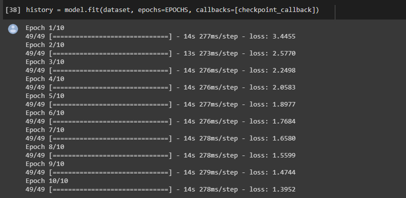
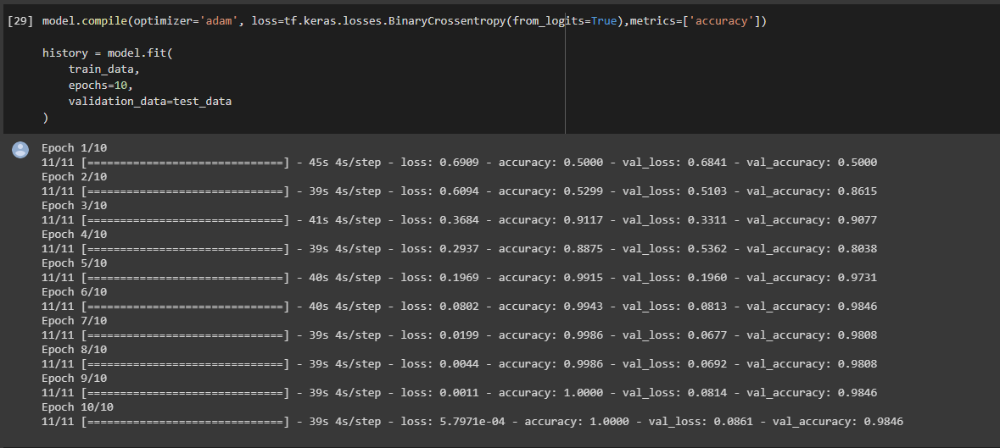
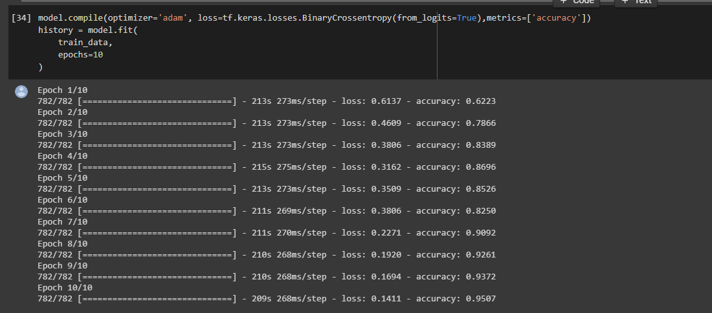

# Deep-Learning-Practice
Google Colab notebooks for Deep Learning Practice.

1) Created Basic Starter Projects for Deep Learning like Cats-vs-Dogs classifer and MNIST classifer. 

2) Created more complex text model using RNN
Here are some screenshots:- 

### 1) Eminem Lyrics Generator
        i) Eminem Lyrics Training:

        ii) Eminem Lyrics Predictions:

### 2) Spam Classifer
        i) Spam Classifer Training

        ii) Spam Classifer Predictions

text_tested:    
`subject futuresignal message send compliance propose federal legislation commercial email s . section . http www . senate . gov murkowskus commercialemail emailamendtext . html pursuant section , paragraph c s . , further transmission sender email stop cost send reply email follow direction below message . attention future trader receive real instant futuresignal over internet note cta . future trader , our service send instant futuresignal vium internet generate follow market s p , nasdaq , e minus , unique future trade opportunity . our futuresignal profit objective scalper , daytrader postion trader . issue trail stop important info hear pit throughout day . our service feature future magazine . free day trial http www . bulkmate . com futuresignal http www . bulkmate . com futuresignal future trade involve risk . risk capital . please read cftc disclaimer our website . remove list , simply send blank email fsremove do it . net note our intention infiltrate advertise invest trading relate discussion group . case , our apology please follow removal instruction above . sent futuresignal email f do it . net address po box , verplanck , ny , telephone")`

### 3) IMDB Review Classifer
        i) IMDB Training

        2) IMDB Prediction

text_tested:    
`The Room review:`

 `Forget all the three-line raves this movie has received (which all seem to be suspiciously similar in tone). THE ROOM is one of those rare laugh-riots that is so fantastically inept as to border on genius. While most bad movies offer a handful of terrible scenes divided by stretches of just plain dull, writer-director-producer-star Tommy Wiseau's film offers one moment of disaster after another.Whether it's the made-up-by-fifth-graders dialogue, the deer-in-headlights performances, or the positively icky sex scenes (love those smushed rose petals on the chubby girl's back), you'll be howling from start to finish.This movie has already amassed a cult of people who know what to yell at the screen and when; for a movie that's being self-distributed, this rates as some kind of crap-movie miracle.Keep an eye out for the pointless insert shots of San Francisco, which give the idea of time passing even when it doesn't: one party scene, for example, features eight of these cut-aways.You really can't believe how terrible THE ROOM is, but at least it's entertaining, albeit in ways that the lazy-eyed, odd-bodied, English-mangling auteur never imagined. Not to be missed.
`